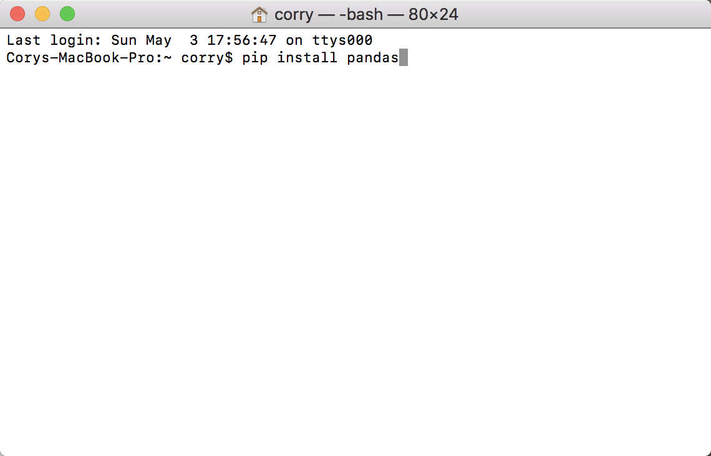

# Network-Science Final Project: ATM Machine

This project is an attempt to predict security fluctuations and help human traders make more rational and favorable decisions. Its decision-making ability will root in machine learning based on neural networks. The ultimate goal of this algorithm is to be trained by historical stock data to achieve the goal of attaining a high win rate as the stock market plays out in real time.

## Design

This is only an entry level machine learnining program that has an ambitious goal of predicting stock prices. It uses a kind of neural network called Deep FeedForward Neural Network (DFFN). 

### Basics of DFFN

The basid structure is as demonstrated in the figure below. Tha analogy is that each node represents a neuron and each edge  represents a synapse. Each neuron holds a value and each synapse has a weight. the neurons are divided into layers with the first layer being input layer, last layer being the output layer, and everything in between being hidden layper. 

When an input is given, it can propagate forward to asign vlues to the neurons in the next layer. Each neuron recieves a value that is the product of each of the previous neirons that lead up to it and their respective synaptic weights. The sum of all these product is then feed into an activation function that normalize the input to between 0 and 1. Here, we use a sigma function. This forward propagation can eventually assign value to the output layer and this is how the neural network is able to "think".

The goal of training this neural network is to make its predictions or outputs as close to the real answers as possible. This is where the back propagation and gradient descent comes to play. An error can be calculated by taking the difference between the predicted output and the given reference output. That difference can be sent backward using derivatives of the activation function. Eventually, the gradient, or slope for each synaptic weight is calculated. Changes to synaptic weights can be made to reduce the error and the process is repeated.


### Observed Issues

Sometimes the training ends with dramatic results such as a stright line a the very top and bottom of the time-price graph. This issue is often fixed after multiple runs of the model. We think this issues is caused by bad choices of initial starting synaptic weights. The training may only lead to a local minimum that is actually very high comparing to the global minimum.

The training speed of this model can be slow at times, and the error is not decresing significantly after many iterations of learning. We think this is because the gradient can be very small at certain points on the graph and the resulting changes to the synaptic weights are small. 


### Modifications 

Several modifications of out own have been added in the hope to address observed problems listed above and improve algorithm performance.

The parameter `NUM_OF_STARTING_POINTS` is just as it sound like. By deploying multiple starting points, we saw significant improvement to the first issue, at the price of longer training time.

The parameter `DRUNKNESS_INDEX` is, well, also as it sounds like. The drunker you are, the less prudent you are at taking steps when walking down the gradient descent. It has been shown to improve training speed and a smaller number of less prudent steps/iterations can achieve the same descent as a larger number of more careful iterations.


### Visualization

Limited visualization is included in this project. For more developed visualizations, please check out Alex's https://github.com/Alexduanran/Group-8---ATM


## Getting Started

These instructions will get you a copy of the project up and running on your local machine for development and testing purposes. See deployment for notes on how to deploy the project on a live system.

### Prerequisites

This project requires you to install pandas, a fast, powerful, flexible and easy to use open source data analysis and manipulation tool, built on top of the Python programming language.

```

Open the terminal, go to the home directory, and type pip install pandas.

```



### Installing

First go to your desired repository and make a local clone of the project. 

```

Example: Corys-MacBook-Pro:project corry$ git clone https://github.com/jienli/ATM.git

```

Then go to the ATM file.

```

Corys-MacBook-Pro:project corry$ cd ATM

```

Open your text editor. In our case we use Atom. 


```

Corys-MacBook-Pro:ATM corry$ atom .

```

Try the files ending with .py. These are the sample results.


## Running the tests

Before running each individual test, change the constant inputs in Constants.py to your desired indexes.

```

Description of what each constant represents: 

TEST: number of testing data sets(stock data of consecutive days after the end of the training set).

REP: number of training set (stock data of consecutive days).

INFO: number of data in each set.

STARTDATE: number of days after the year of 2005, January 1, as the starting date of our test. 

TRAIN_ITERATION: number of training iterations.

NUM_OF_STARTING_POINTS: mumber of starting points.

STRUCTURE: neural network structure, number of nodes in each layer(first layer need to match info), last layer need to be 1, only 3 layers for now.

TICKER: the stock symbol. 

BIAS: a bias when initializing the random synaptic weights. It has been shown to improve performance of machine learning models.

DRUNKNESS_INDEX: think of this as size of step when "walking" down the gradient descent. Speed of training. 

```

```

Examples Constants set
TEST = 100
REP = 200
INFO = 10
STARTDATE = 2500
TRAIN_ITERATION = 10000
NUM_OF_STARTING_POINTS = 5
STRUCTURE = [10,3,1]
TICKER = 'GOOG'


BIAS = -1
DRUNKNESS_INDEX = 1.2

```

result: (just examples)


### Break down into end to end tests

Explain what these tests test and why

```

Give an example

```

### And coding style tests

Explain what these tests test and why

```

Give an example

```

## Deployment

Add additional notes about how to deploy this on a live system

## Built With

* [numpy] - Used for fast matri manipulations
* [pandas] - For retrieving historical stock data


## Versioning

This is the only version!

## Authors

* **Jien Li** 
* **Anran Du** 
* **Chuyu Duan** 


## License

License? What license?

## Acknowledgments

* thank you for reading this far

